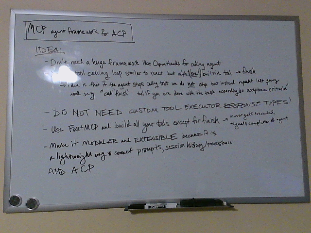

<p align="center">
    
</p>

# `crow`



The `crow` monorepo is a Python-native agent framework connecting FastMCP and Agent Client Protocol.

## Monorepo Structure

```
crow/
├── crow-agent/         # Programmatic SDK for long-running workflows w/custom extensions
├── crow-compact/       # Post-response callback to check token threshold
├── crow-core/          # ACP native react agent w/MCP + chat + extension system
├── crow-mcp-server/    # Built-in MCP tools (file_editor, web_search, fetch)
├── crow-persistence/   # Post-response hook to save session to DB
├── crow-skills/        # Pre-request callback to inject filesystem context
└── pyproject.toml      # Workspace configuration (uv workspace members)
```

## Key Features

- **ACP-Native**: Implements Agent Client Protocol directly
- **MCP Integration**: Connects to FastMCP servers for tools
- **Extension System**: Flask-inspired hooks/callbacks for extensibility
- **Monorepo**: Clean package boundaries with independent installability

### ACP Protocol Understanding

From `uv --project . run python -c "import acp"`:

**SessionInfo** - The source of truth:
- `sessionId` - Unique identifier (REQUIRED)
- `cwd` - Working directory (REQUIRED, must be absolute path)
- `title` - Human-readable title (optional)
- `updatedAt` - ISO 8601 timestamp (optional)
- `_meta` - Custom metadata (reserved by ACP)

**Update Types** - Agent communicates via `session/update`:
- `"plan"` → AgentPlanUpdate (execution plan)
- `"user_message_chunk"` → User's message
- `"agent_message_chunk"` → Agent's response
- `"tool_call"` → Tool call started
- `"tool_call_update"` → Tool call progress/status
- `"usage_update"` → Token usage/cost info

**Tool Call Content Types** - How to display outputs:
- `"content"` → Text/image/audio
- `"diff"` → **Show diff UI** (file edits)
- `"terminal"` → **Show terminal UI**

Basically the idea is that we can use FastMCP as our tool calling framework in the exact same way we are going to use Agent Client Protocol to communicate with the frontend.

And with this framework-less agent framework where we're just trying to connect people's [FastMCP](https://github.com/jlowin/fastmcp) and [Agent Client Protocol](https://github.com/agentclientprotocol/python-sdk) agents and largely get the hell out of the way, being able to demonstrate a proof of concept in around 200 lines of code is pretty powerful.

[`streaming_async_react.py`](./streaming_async_react.py)
```python
import asyncio
import json
import os
import traceback

from dotenv import load_dotenv
from fastmcp import Client
from openai import OpenAI

load_dotenv()


def configure_provider():
    return OpenAI(api_key=os.getenv("ZAI_API_KEY"), base_url=os.getenv("ZAI_BASE_URL"))


def setup_mcp_client(mcp_path="search.py"):
    return Client(mcp_path)


async def get_tools(mcp_client):
    mcp_tools = await mcp_client.list_tools()
    tools = [
        {
            "type": "function",
            "function": {
                "name": tool.name,
                "description": tool.description,
                "parameters": tool.inputSchema,
            },
        }
        for tool in mcp_tools
    ]
    return tools


def send_request(messages, model, tools, lm):
    try:
        response = lm.chat.completions.create(
            model=model,
            messages=messages,
            tools=tools,
            stream=True,
        )
        return response
    except Exception as e:
        traceback.print_exc()
        raise ValueError(f"Error sending request: {e}")


def process_chunk(chunk, thinking, content, tool_calls, tool_call_id):
    delta = chunk.choices[0].delta
    new_token = (None, None)
    if not delta.tool_calls:
        if not hasattr(delta, "reasoning_content"):
            verbal_chunk = delta.content
            if verbal_chunk:
                content.append(verbal_chunk)
                new_token = ("content", verbal_chunk)
        else:
            reasoning_chunk = delta.reasoning_content
            if reasoning_chunk:
                thinking.append(reasoning_chunk)
                new_token = ("thinking", reasoning_chunk)
    else:
        for call in delta.tool_calls:
            if call.id is not None:
                tool_call_id = call.id
                if call.id not in tool_calls:
                    tool_calls[call.id] = dict(
                        function_name=call.function.name,
                        arguments=[call.function.arguments],
                    )
                    new_token = (
                        "tool_call",
                        (call.function.name, call.function.arguments),
                    )
            else:
                arg_fragment = call.function.arguments
                tool_calls[tool_call_id]["arguments"].append(arg_fragment)
                new_token = ("tool_args", arg_fragment)
    return thinking, content, tool_calls, tool_call_id, new_token


def process_response(response):
    thinking, content, tool_calls, tool_call_id = [], [], {}, None
    for chunk in response:
        thinking, content, tool_calls, tool_call_id, new_token = process_chunk(
            chunk, thinking, content, tool_calls, tool_call_id
        )
        msg_type, token = new_token
        if msg_type:
            yield msg_type, token
    return thinking, content, process_tool_call_inputs(tool_calls)


def process_tool_call_inputs(tool_calls):
    tool_call_inputs = []
    for tool_call_id, tool_call in tool_calls.items():
        tool_call_inputs.append(
            dict(
                id=tool_call_id,
                type="function",
                function=dict(
                    name=tool_call["function_name"],
                    arguments="".join(tool_call["arguments"]),
                ),
            )
        )
    return tool_call_inputs


async def execute_tool_calls(mcp_client, tool_call_inputs, verbose=True):
    tool_results = []
    for tool_call in tool_call_inputs:
        result = await mcp_client.call_tool(
            tool_call["function"]["name"],
            json.loads(tool_call["function"]["arguments"]),
        )
        tool_results.append(
            dict(
                role="tool",
                tool_call_id=tool_call["id"],
                content=result.content[0].text,
            )
        )
        if verbose:
            print()
            print("TOOL RESULT:")
            print(f"{tool_call['function']['name']}: ")
            print(f"{result.content[0].text}")
    return tool_results


def add_response_to_messages(
    messages, thinking, content, tool_call_inputs, tool_results
):
    if len(content) > 0 and len(thinking) > 0:
        messages.append(
            dict(
                role="assistant",
                content="".join(content),
                reasoning_content="".join(thinking),
            )
        )
    elif len(thinking) > 0:
        messages.append(dict(role="assistant", reasoning_content="".join(thinking)))
    elif len(content) > 0:
        messages.append(dict(role="assistant", content="".join(content)))
    if len(tool_call_inputs) > 0:
        messages.append(dict(role="assistant", tool_calls=tool_call_inputs))
    if len(tool_results) > 0:
        messages.extend(tool_results)
    return messages


async def react_loop(messages, mcp_client, lm, model, tools, max_turns=50000):
    for _ in range(max_turns):
        response = send_request(messages, model, tools, lm)
        gen = process_response(response)
        while True:
            try:
                msg_type, token = next(gen)
                yield {"type": msg_type, "token": token}
            except StopIteration as e:
                thinking, content, tool_call_inputs = e.value
                break
        if not tool_call_inputs:
            messages = add_response_to_messages(messages, thinking, content, [], [])
            yield {"type": "final_history", "messages": messages}
            return  # This ends the generator
        tool_results = await execute_tool_calls(
            mcp_client, tool_call_inputs, verbose=False
        )
        messages = add_response_to_messages(
            messages, thinking, content, tool_call_inputs, tool_results
        )


async def main():
    mcp_client = setup_mcp_client()
    lm = configure_provider()
    messages = [
        dict(role="system", content="You are a helpful assistant named Crow."),
        dict(
            role="user",
            content="search for machine learning papers with your search tool",
        ),
    ]
    final_history = []
    async with mcp_client:
        tools = await get_tools(mcp_client)
        async for chunk in react_loop(messages, mcp_client, lm, "glm-4.7", tools):
            if chunk["type"] == "content":
                print(chunk["token"], end="", flush=True)
            elif chunk["type"] == "thinking":
                print(f"\n[Thinking]: {chunk['token']}", end="", flush=True)
            elif chunk["type"] == "tool_call":
                name, first_arg = chunk["token"]
                print(f"\n[Tool Call]: {name}({first_arg}", end="", flush=True)
            elif chunk["type"] == "tool_args":
                print(chunk["token"], end="", flush=True)
            elif chunk["type"] == "final_history":
                final_history = chunk["messages"]
    return final_history


if __name__ == "__main__":
    asyncio.run(main())
```

and we've also added a persistent database to store the conversation. Now we really just need to wrap the emitted token to status_updates for ACP and we're in business.  I would build more on our existing work with [`crow`](https://github.com/odellus/crow), but we've basically got to reimplement the entire thing from scratch now lol. That's what getting rid of openhands means.

## Current Status

**Status**: 85% Complete - Core architecture working

See `IMPLEMENTATION_PLAN.md` for detailed status and `PULSE_CHECK.md` for comprehensive analysis.

## Monorepo Transition

We're currently in the process of transitioning from a single-package structure to a monorepo with clean package boundaries:

**Current**: Single `src/crow/agent/` package with `crow-mcp-server/` as a dependency

**Target**: Monorepo with root-level packages:
- `crow-agent/` - Programmatic SDK for long-running workflows
- `crow-compact/` - Post-response token threshold checker
- `crow-core/` - ACP native react agent
- `crow-mcp-server/` - Built-in MCP tools
- `crow-persistence/` - Session persistence hook
- `crow-skills/` - Context injection via skills

See `docs/essays/10-monorepo-refactor-to-avoid-cyclic-dependencies.md` for detailed analysis.

## Key Features

- **ACP-Native**: Implements Agent Client Protocol directly
- **MCP Integration**: Connects to FastMCP servers for tools
- **Extension System**: Flask-inspired hooks/callbacks for extensibility
- **Monorepo**: Clean package boundaries with independent installability

## Documentation

- `AGENTS.md` - Development patterns and best practices
- `IMPLEMENTATION_PLAN.md` - Current status and next steps
- `docs/essays/` - Detailed architecture decisions and analysis
- `PULSE_CHECK.md` - Comprehensive status analysis

## TO DO

- session management and persistence to sqlite through sqlalchemy ✅ (done)
- compaction
- prompt management — proper, with version and input variables all stored in memory every time a new prompt is created or rendered (we refer back to versioned prompt, which is crucial for evaluation)
- skills — part of prompt management, we need to do a keyword check for skills and insert the necessary progressive disclosure around the skill into the context after the user's request.
- agent client protocol and we mean the whole thing ✅ (mostly done)
- monorepo refactor - transition to clean package boundaries
- CLI is going to be in crow we've already got that sorted out this is just going to drop down where openhands and the acp used to be because instead of having an openhands sdk and then a whole big acp we'll just be able to use `crow`'s built in ACP because that's the thing about it being a frameworkless framework of minimal non-extensions built between two protocols that's basically the ACP and openai chat completion sdk's minimal spanning set right?
