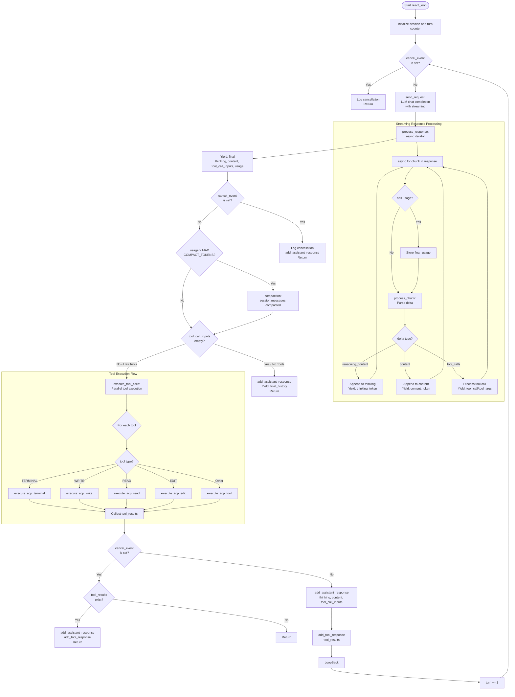

    

# `crow-cli`
Monorepo for `crow-cli`
- [`crow-cli`](./crow-cli/README.md)
- [`crow-mcp`](./crow-mcp/README.md)

```mermaid
flowchart TD
    Start([Start react_loop]) --> Init[Initialize session and turn counter]
    Init --> CheckCancel{cancel_event<br/>is set?}
    
    CheckCancel -->|Yes| CancelStart[Log cancellation<br/>Return]
    CheckCancel -->|No| SendRequest[send_request:<br/>LLM chat completion<br/>with streaming]
    
    SendRequest --> ProcessResponse[process_response:<br/>async iterator]
    
    subgraph Streaming[Streaming Response Processing]
        ProcessResponse --> AsyncFor[async for chunk in response]
        AsyncFor --> CheckUsage{has usage?}
        CheckUsage -->|Yes| StoreUsage[Store final_usage]
        CheckUsage -->|No| ProcessChunk
        StoreUsage --> ProcessChunk
        
        ProcessChunk[process_chunk:<br/>Parse delta] --> CheckDelta{delta type?}
        
        CheckDelta -->|reasoning_content| AppendThinking[Append to thinking<br/>Yield: thinking, token]
        CheckDelta -->|content| AppendContent[Append to content<br/>Yield: content, token]
        CheckDelta -->|tool_calls| ProcessTool[Process tool call<br/>Yield: tool_call/tool_args]
        
        AppendThinking --> AsyncFor
        AppendContent --> AsyncFor
        ProcessTool --> AsyncFor
    end
    
    ProcessResponse --> YieldFinal[Yield: final<br/>thinking, content, tool_call_inputs, usage]
    
    YieldFinal --> CheckCancelStream{cancel_event<br/>is set?}
    CheckCancelStream -->|Yes| CancelBeforeTool[Log cancellation<br/>add_assistant_response<br/>Return]
    CheckCancelStream -->|No| CheckUsagePreTool{usage > MAX<br/>COMPACT_TOKENS?}
    
    CheckUsagePreTool -->|Yes| Compaction[compaction:<br/>session.messages compacted]
    CheckUsagePreTool -->|No| CheckTools{tool_call_inputs<br/>empty?}
    
    Compaction --> CheckTools
    
    CheckTools -->|Yes - No Tools| AddFinalResponse[add_assistant_response<br/>Yield: final_history<br/>Return]
    
    CheckTools -->|No - Has Tools| ExecuteTools[execute_tool_calls:<br/>Parallel tool execution]
    
    subgraph ToolExecution[Tool Execution Flow]
        ExecuteTools --> ToolLoop{For each tool}
        ToolLoop --> DetectToolType{tool type?}
        
        DetectToolType -->|TERMINAL| execTerminal[execute_acp_terminal]
        DetectToolType -->|WRITE| execWrite[execute_acp_write]
        DetectToolType -->|READ| execRead[execute_acp_read]
        DetectToolType -->|EDIT| execEdit[execute_acp_edit]
        DetectToolType -->|Other| execGeneric[execute_acp_tool]
        
        execTerminal --> CollectResults
        execWrite --> CollectResults
        execRead --> CollectResults
        execEdit --> CollectResults
        execGeneric --> CollectResults
        
        CollectResults[Collect tool_results]
    end
    
    CollectResults --> CheckCancelAfter{cancel_event<br/>is set?}
    
    CheckCancelAfter -->|Yes| CancelAfterTool{tool_results<br/>exist?}
    CancelAfterTool -->|Yes| AddBothResponses[add_assistant_response<br/>add_tool_response<br/>Return]
    CancelAfterTool -->|No| ReturnEmpty[Return]
    
    CheckCancelAfter -->|No| AddAssistant[add_assistant_response<br/>thinking, content, tool_call_inputs]
    AddAssistant --> AddTool[add_tool_response<br/>tool_results]
    AddTool --> LoopBack
    
    LoopBack --> IncrementTurn[turn += 1]
    IncrementTurn --> CheckCancel
```
