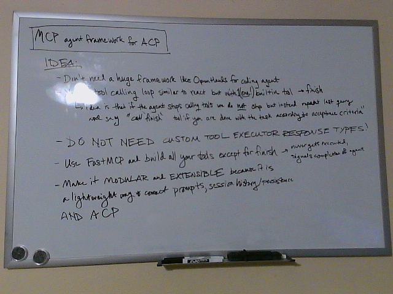

<p align="center">
    
</p>

# 🐦‍⬛ Crow

Monorepo for [crow-cli](./crow-cli/README.md) and [crow-mcp](./crow-mcp/README.md).

Crow is a **two-layer system**: an **ACP agent** (`crow-cli`) that does the thinking, and an **MCP toolserver** (`crow-mcp`) that does the doing.



---

## Architecture

```
User → ACP Client → crow-cli (AcpAgent)
                         ↓
                    ReAct Loop ←→ LLM (OpenAI-compatible)
                         ↓
                    Tool Dispatch
                    ├── ACP Client Terminal (if supported)
                    └── crow-mcp (MCP Server)
                        ├── terminal (PTY)
                        ├── read/write/edit
                        ├── web_search (SearXNG)
                        └── web_fetch (readabilipy)
```

---

## `crow-mcp` — The Toolserver

A [FastMCP](https://github.com/jlowin/fastmcp) server that exposes **7 tools**:

| Tool | What it does |
|---|---|
| **`terminal`** | PTY-backed bash session. Spawns a real pseudoterminal (`pty.openpty()`), sets a custom PS1 prompt with metadata (exit code, cwd), runs commands, and polls for completion via PS1 detection. Supports `C-c`/`C-z`/`C-d` special keys, stdin input, soft timeout (30s no output), and hard timeout. |
| **`read`** | Reads files with line numbers, binary detection, 10MB limit, pagination via `offset`/`limit`. |
| **`write`** | File writer with auto `mkdir -p`. |
| **`edit`** | **9 cascading fuzzy matchers** for string replacement: exact → line-trimmed → block-anchor (Levenshtein) → whitespace-normalized → indentation-flexible → escape-normalized → trimmed-boundary → context-aware (50% middle match) → multi-occurrence. Falls through until one matches. |
| **`web_search`** | Queries a local SearXNG instance, returns structured results. |
| **`web_fetch`** | Fetches URLs, uses `readabilipy` + `markdownify` to extract clean markdown from HTML. Supports pagination. |

The terminal backend uses a background `threading.Thread` that continuously reads from the PTY master fd via `select()`, with a `deque` buffer and proper signal handling (`SIGINT` to process group, `SIGTERM`→`SIGKILL` cleanup).

---

## `crow-cli` — The Agent Brain

An **ACP-native agent** (implements the [Agent Communication Protocol](https://github.com/anthropics/acp)) with these key components:

### `AcpAgent` — ACP Protocol Implementation

- Implements `Agent` interface: `initialize`, `new_session`, `load_session`, `prompt`, `cancel`, `cleanup`
- Manages `AsyncExitStack` for resource lifecycle
- On `new_session`: loads system prompt from Jinja2 template, reads `AGENTS.md` from workspace, builds directory tree, creates MCP client, stores session
- On `prompt`: spawns the ReAct loop as an `asyncio.Task` for cancellation support, streams chunks back to client via ACP updates
- Supports **model switching** at runtime via `set_config_option`
- Detects client capabilities — if the ACP client supports terminals, uses client-side terminals; otherwise falls back to MCP terminals

### `react_loop` — The ReAct Loop

- Classic Reason+Act loop, up to 50,000 turns
- Streams LLM responses via OpenAI-compatible API with exponential backoff retries
- `process_chunk` handles streaming deltas: content tokens, thinking/reasoning tokens, and tool call accumulation
- After each LLM response, checks token usage against `MAX_COMPACT_TOKENS` (120k) and triggers compaction if exceeded
- Tool execution is **dual-mode**: ACP client terminals for supported clients, MCP tools for everything else
- Cancellation is handled at every level — mid-stream state gets persisted via `state_accumulator`

### `compact` — Context Window Compaction

- When tokens exceed threshold, asks the LLM to summarize the conversation middle (everything between first and last user message)
- Creates a new session with `[first_user_msg, summary, last_user_msg_onwards...]`
- Atomically swaps session IDs in the database (old→archive, new→original_id)
- Updates the session **in-place** so all references see the new state

### `Session` — Persistence Layer

- SQLAlchemy-backed, **one row per message**
- `Session.create()` renders the Jinja2 system prompt, creates DB records
- `Session.load()` deserializes messages back
- `swap_session_id()` for atomic compaction swaps
- Uses `coolname` for memorable session IDs (e.g., `brave-purple-tiger-a3f2c1`)

### `tools` — ACP Tool Execution Bridge

- Routes tool calls to either **ACP client capabilities** (terminal, read, write) or **MCP server** (edit, search, fetch, etc.)
- Sends proper ACP `ToolCallStart`/`ToolCallProgress` updates with rich content (terminal streams, file diffs, text results)
- The edit tool sends diff content to the client for display
- Handles malformed JSON from LLMs gracefully (fixes args in-place, sends error back)

### `configure` — YAML Config System

- Reads `~/.crow/config.yaml` with `${ENV_VAR}` interpolation
- Supports multiple LLM providers/models (provider name + base_url + API key)
- Auto-corrects common SQLite URI misconfiguration
- MCP server config with auto-path-correction for development

### `prompt` — Multimodal Content Normalization

- Converts ACP content blocks (text, image, resource, resource_link) to OpenAI format
- Handles image blocks: base64 data, `file://` URIs, `http://` URIs → all become `data:` URLs
- Resource links resolve to file contents with line numbers

### System Prompt

Jinja2 template that injects:
- Working directory + directory tree
- `AGENTS.md` content (persistent memory across sessions)
- Behavioral guidelines

---

## ReAct Loop Flowchart


```mermaid
flowchart TD
    Start([Start react_loop]) --> Init[Initialize session and turn counter]
    Init --> CheckCancel{cancel_event<br/>is set?}
    
    CheckCancel -->|Yes| CancelStart[Log cancellation<br/>Return]
    CheckCancel -->|No| SendRequest[send_request:<br/>LLM chat completion<br/>with streaming]
    
    SendRequest --> ProcessResponse[process_response:<br/>async iterator]
    
    subgraph Streaming[Streaming Response Processing]
        ProcessResponse --> AsyncFor[async for chunk in response]
        AsyncFor --> CheckUsage{has usage?}
        CheckUsage -->|Yes| StoreUsage[Store final_usage]
        CheckUsage -->|No| ProcessChunk
        StoreUsage --> ProcessChunk
        
        ProcessChunk[process_chunk:<br/>Parse delta] --> CheckDelta{delta type?}
        
        CheckDelta -->|reasoning_content| AppendThinking[Append to thinking<br/>Yield: thinking, token]
        CheckDelta -->|content| AppendContent[Append to content<br/>Yield: content, token]
        CheckDelta -->|tool_calls| ProcessTool[Process tool call<br/>Yield: tool_call/tool_args]
        
        AppendThinking --> AsyncFor
        AppendContent --> AsyncFor
        ProcessTool --> AsyncFor
    end
    
    ProcessResponse --> YieldFinal[Yield: final<br/>thinking, content, tool_call_inputs, usage]
    
    YieldFinal --> CheckCancelStream{cancel_event<br/>is set?}
    CheckCancelStream -->|Yes| CancelBeforeTool[Log cancellation<br/>add_assistant_response<br/>Return]
    CheckCancelStream -->|No| CheckUsagePreTool{usage > MAX<br/>COMPACT_TOKENS?}
    
    CheckUsagePreTool -->|Yes| Compaction[compaction:<br/>session.messages compacted]
    CheckUsagePreTool -->|No| CheckTools{tool_call_inputs<br/>empty?}
    
    Compaction --> CheckTools
    
    CheckTools -->|Yes - No Tools| AddFinalResponse[add_assistant_response<br/>Yield: final_history<br/>Return]
    
    CheckTools -->|No - Has Tools| ExecuteTools[execute_tool_calls:<br/>Parallel tool execution]
    
    subgraph ToolExecution[Tool Execution Flow]
        ExecuteTools --> ToolLoop{For each tool}
        ToolLoop --> DetectToolType{tool type?}
        
        DetectToolType -->|TERMINAL| execTerminal[execute_acp_terminal]
        DetectToolType -->|WRITE| execWrite[execute_acp_write]
        DetectToolType -->|READ| execRead[execute_acp_read]
        DetectToolType -->|EDIT| execEdit[execute_acp_edit]
        DetectToolType -->|Other| execGeneric[execute_acp_tool]
        
        execTerminal --> CollectResults
        execWrite --> CollectResults
        execRead --> CollectResults
        execEdit --> CollectResults
        execGeneric --> CollectResults
        
        CollectResults[Collect tool_results]
    end
    
    CollectResults --> CheckCancelAfter{cancel_event<br/>is set?}
    
    CheckCancelAfter -->|Yes| CancelAfterTool{tool_results<br/>exist?}
    CancelAfterTool -->|Yes| AddBothResponses[add_assistant_response<br/>add_tool_response<br/>Return]
    CancelAfterTool -->|No| ReturnEmpty[Return]
    
    CheckCancelAfter -->|No| AddAssistant[add_assistant_response<br/>thinking, content, tool_call_inputs]
    AddAssistant --> AddTool[add_tool_response<br/>tool_results]
    AddTool --> LoopBack
    
    LoopBack --> IncrementTurn[turn += 1]
    IncrementTurn --> CheckCancel
```

---

## License

[Apache-2.0](./LICENSE.md)
